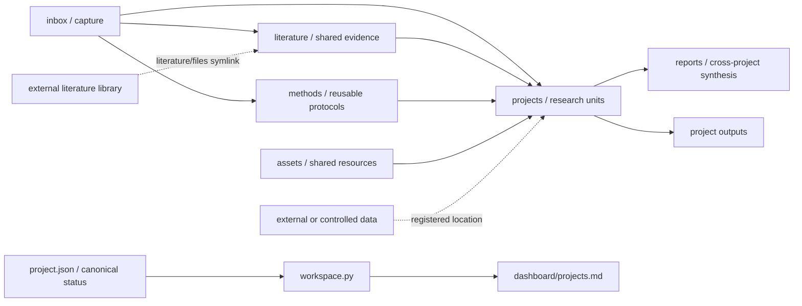
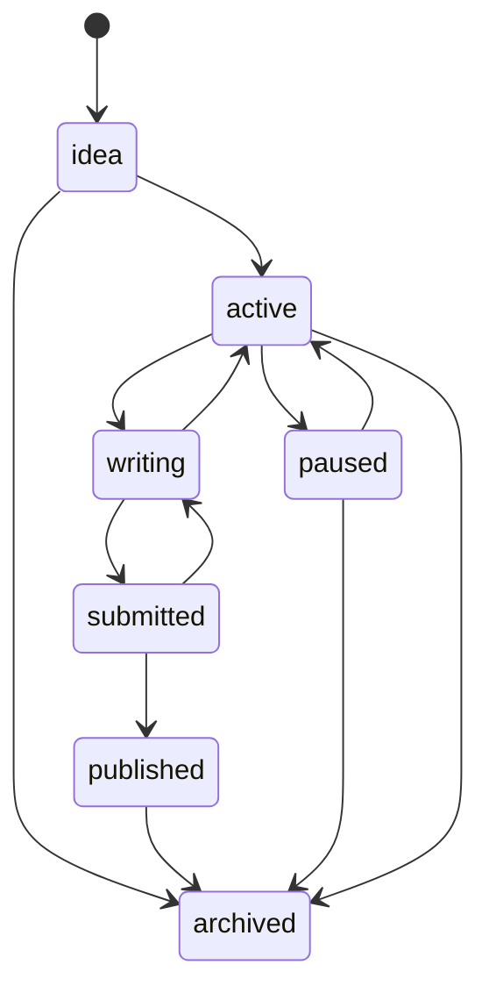

# Architecture

- 状态：Current
- 架构版本：2
- 最后更新：2026-07-19

本文说明 Academic Workspace 的系统边界、核心不变量、信息流和演进方式。目录的具体使用规则仍以各目录 `README.md` 为准；本文回答的是“为什么这样组织，以及改变结构时必须保持什么”。

## 1. Goals

工作区面向一个研究者或小型研究团队的长期、多课题并行工作，优先满足以下质量属性：

1. **可追溯**：结论能够回到文献、数据、代码、运行记录或明确推理。
2. **可组合**：每个课题独立运行，同时复用共享文献、方法和素材。
3. **可检查**：关键状态机器可读，结构漂移可以被工具发现。
4. **稳定**：项目、引用和产物使用稳定路径，不因状态变化频繁移动。
5. **可移植**：核心工作流只依赖 Git、Markdown、JSON、uv 和 Python 标准库。
6. **安全默认**：大型、敏感、受限和不可再生材料默认不进入 Git。

本架构不试图统一所有项目的研究方法、编程语言、统计框架或写作工具。它只规定跨项目协作所需的最低契约。

## 2. System model

工作区由四个逻辑层组成：

| Layer | Directories / files | Responsibility |
| --- | --- | --- |
| Capture | `inbox/` | 低摩擦收集尚未判断归属的材料 |
| Knowledge | `literature/`, `methods/`, `assets/` | 保存跨项目复用的文献、方法和素材 |
| Research | `projects/<slug>/` | 保存项目专属问题、证据、数据、分析、写作和产物 |
| Portfolio | `dashboard/`, `reports/`, `archive/` | 管理项目组合、周期复盘、跨项目总结和非项目历史材料 |

`workspace.json`、`schemas/` 和 `scripts/` 构成控制层；`pyproject.toml` 与 `uv.lock` 固定其 Python 环境。根 `package.json` 是可选 Node 工具层，不属于研究数据面。



箭头表示知识或状态流向，不表示文件必须被复制。共享内容应通过相对链接引用。

## 3. Sources of truth

同一事实只保留一个权威来源：

| Information | Canonical source | Derived or secondary view |
| --- | --- | --- |
| 工作区配置 | `workspace.json` | CLI 运行时配置 |
| Python 工具环境 | `pyproject.toml`, `uv.lock` | uv 创建的本地虚拟环境 |
| 可选 Node 工具环境 | `package.json`, `package-lock.json` | `node_modules/` |
| 元数据结构 | `schemas/*.schema.json` | README 中的人类可读说明 |
| 项目状态、分类和复盘日期 | `projects/<slug>/project.json` | `dashboard/projects.md` |
| 项目当前问题、综合判断和限制 | 项目 `README.md` | 项目笔记中的过程记录，报告和汇报材料 |
| 论文元数据、文件路径和下载地址 | `literature/catalog.json` | BibTeX、阅读笔记和阅读队列 |
| 文献引用 | `literature/bibliography.bib` | 论文元数据目录、阅读笔记和项目引用 |
| 文献综合 | `literature/reading-notes/`, `topic-reviews/` | 项目笔记和报告中的引用 |
| 数据集登记、分类和当前位置 | 项目 `data/README.md` | `data/metadata/` 中的数据字典、清单和校验文件 |
| 分析复现方式 | 项目 `analysis/README.md` 和运行记录 | 输出产物说明 |
| 项目产物登记与复现入口 | 项目 `outputs/` | `reports/` 中的跨项目引用 |

项目笔记是带时间语境的过程证据，项目 README 是当前综合结论；发生冲突时，以 README 对“当前理解”的表述为准，同时保留并链接导致变化的历史笔记。`data/README.md` 是数据登记索引，`data/metadata/` 保存被索引的详细文件；二者冲突时先修正登记索引，再同步详细元数据。

禁止手工维护与权威来源竞争的第二套状态。例如，项目状态只能修改 `project.json`，然后重新生成 dashboard。

## 4. Project boundary

每个 `projects/<slug>/` 是一个稳定、自包含的研究边界：

- `project.json` 保存组合管理所需的短字段。
- `README.md` 是面向人的研究入口。
- `planning/` 保存设计、会议和决策历史。
- `notes/` 保存项目专属推理，不复制共享文献笔记。
- `data/` 保存数据登记、元数据和逻辑入口。
- `analysis/` 保存分析入口、代码和轻量运行记录。
- `writing/` 保存可编辑源稿。
- `outputs/` 保存正式产物的登记、版本、来源和复现入口；渲染后的 PDF 默认存放在仓库外。
- `archive/` 保存项目内部被替代的历史材料。

项目 `id` 和目录 slug 创建后视为不可变标识。确需重命名时，将其作为显式迁移：使用 Git 移动目录，更新 `project.json.id`、所有 `relatedProjects`、仓库内链接和 dashboard，并通过完整检查；不得把重命名当作普通整理操作。

项目结束后保留原目录并执行最小归档步骤：

1. 将状态改为 `archived`，更新 `updated`，清空 `nextAction` 和 `nextReview`。
2. 在项目 README 记录结束日期、完成/取消/合并等原因、最终理解和可能的恢复条件。
3. 在决策日志保留归档决定，不删除未完成或相互矛盾的历史记录。
4. 重新生成 dashboard 并运行工作区检查。

稳定路径比“把旧项目搬走以保持整洁”更重要。`archived` 表示不再活跃，不等同于“成功完成”；具体结束原因保存在项目 README 和决策日志中。

### Lifecycle



状态图是解释性模型，不是强制自动机。当前 CLI 校验状态值和 `active`/`writing` 的必填行动，但不校验历史转换；需要审计转换时，以决策日志为依据。

## 5. Metadata and consistency model

项目元数据采用 JSON/JSONC，因为它可由 JSON Schema 描述，并适合由编辑器和脚本共同维护。仓库文件默认写成严格 JSON，以兼容所有标准工具；工作区 Python 读取入口通过 `scripts/jsonc.py` 额外支持注释和尾逗号。复杂研究内容不进入 JSON，避免把知识压缩成脆弱字段。

当前版本契约为：根 `workspace.json.schemaVersion = 2`，各项目 `project.json.schemaVersion = 1`。CLI 只接受它明确支持的版本，遇到未知版本直接失败，且不得在读取时自动升级。

`schemas/` 是声明式和编辑器侧契约；为保持零第三方依赖，运行时 CLI 不执行完整 JSON Schema 引擎，而是显式校验当前使用的字段、类型、枚举、日期、唯一性、项目引用和条件必填规则。Schema 新增约束时，必须同时增加等价 CLI 校验和回归测试，否则该约束不能视为已实施。

一致性采用“权威源 + 可再生视图”模型：

1. 用户或助手修改 `project.json`。
2. `workspace.py dashboard` 读取所有项目元数据并重建 dashboard。
3. `workspace.py check` 校验目录、字段、日期、项目引用、本地 Markdown 链接、文献软链接和 dashboard 漂移。
4. 如果项目无效，dashboard 不会被部分更新。

项目创建使用同一文件系统内的临时目录，完成写入后再原子重命名到目标位置。如果后续 dashboard 更新失败，CLI 回滚新项目目录；dashboard 本身也使用原子文件替换。因此 `new` 要么同时留下有效项目和同步 dashboard，要么不留下新项目。

## 6. Data and trust boundaries

Git 仓库是知识、元数据和可复现过程的边界，不是所有研究文件的默认存储位置。

### Allowed by default

- Markdown 研究记录和决策；
- JSON 元数据、数据字典和文件清单；
- BibTeX；
- 分析代码、依赖锁文件和轻量测试数据；
- 许可允许的项目源稿、可复现代码和轻量产物元数据。

### External or controlled by default

- 文献全文和出版社补充材料；
- 大型原始或处理数据；
- 包含个人身份信息的数据；
- 受合同、伦理审批、保密或版权限制的材料；
- 大型模型、缓存、日志和可再生中间产物；
- 渲染后的 PDF 和可由源稿重新生成的二进制交付物；
- 密钥、令牌和凭据。

`literature/files` 是唯一标准文献全文入口，并且必须是仓库外目录的本机软链接。项目数据不强制使用统一外部存储系统，但其位置、许可、分类、版本和校验信息必须按 [数据管理规范](methods/data-management.md) 登记。

“大型”没有跨项目统一字节阈值：凡是不适合普通 Git clone、无法有效审阅 diff、可从过程再生或受许可限制的载荷，都默认外置。敏感等级使用 `public`、`internal`、`sensitive`、`restricted` 四级词表，并以项目中最高等级作为默认处理级别。

数据登记优先使用逻辑数据集标识、仓库相对入口或可移植 URI，不把某台机器的用户绝对路径当作唯一定位信息。设备专属映射应保留在 Git 忽略的本机配置中，并在登记表说明如何重建。

## 7. Automation boundary

`scripts/workspace.py` 是结构与文献入库管理的唯一正式 CLI，通过 `uv run` 使用锁定的 Python 3.9+ 环境。结构命令保持轻量；PDF 元数据读取使用锁定的 `pypdf` 依赖。CLI 提供：

- `new`：从 `_template` 创建项目，与 dashboard 更新共同提交或共同回滚；
- `check`：只读验证工作区；
- `dashboard`：从权威元数据重建项目总览；
- `paper add`：预演或执行论文全文复制、校验、去重，以及论文元数据目录、BibTeX、阅读笔记、队列和课题关联的联合登记。

除 `paper add` 外，CLI 不读取或修改外部文献全文。`paper add` 只能通过有效软链接访问仓库外全文库，使用复制与 SHA-256 校验，不删除下载源文件、不覆盖冲突内容，并对本次联合写入执行回滚。CLI 不处理项目研究数据，也不替代项目自己的分析工作流。

工作区不支持裸 `python3 scripts/workspace.py ...` 作为正式入口。Python 工具依赖使用 uv 管理；根 npm 包只为 Agent 插件、Markdown lint 等可选仓库工具提供依赖位置，不得把具体研究项目的运行环境集中到根 `package.json`。

## 8. Git and collaboration model

所有长期项目共存在同一主工作分支，确保 dashboard、共享知识和项目关系始终可同时观察。Git 分支只用于短期变更、实验性重构和协作审阅，完成后合并。

工作区采用 Git 级协作而不是应用级并发控制：同一项目元数据或 dashboard 在同一时刻只应有一个写者。小团队通过短期分支、提交和代码审阅协调；发生冲突时重新从合并后的 `project.json` 生成 dashboard，不手工拼接生成行。

工作区级规则写入根 `AGENTS.md`；目录规则写入最近的 `README.md`；项目特例写入项目 README。规则越具体，离材料越近。

`.agents/skills/` 是有意版本化的 AI 工具能力，`.claude/skills` 是兼容软链接。它们属于协作工具层，不是研究证据层。

## 9. Key architectural decisions

| Decision | Why | Consequence |
| --- | --- | --- |
| Markdown 与 JSON 分离 | 人类知识和机器状态具有不同变化方式 | 两者需要明确边界，但避免解析自由文本 |
| Dashboard 由元数据生成 | 消除重复状态和长期漂移 | 项目状态变更后必须重新生成 |
| 文献全文仓库外存储 | 控制 Git 体积、版权和设备差异 | 新设备必须重新配置软链接 |
| 原始数据和渲染产物安全默认 | 避免误提交大型、敏感或可再生材料 | 项目必须维护数据登记、源稿和复现命令 |
| 稳定项目路径 | 保护引用、复现脚本和历史链接 | archived 项目仍保留在 `projects/` |
| 单一长期工作分支 | 保持跨项目知识和组合视图完整 | 分支不能充当项目目录 |
| uv 管理的工作区 CLI | 锁定 Python 与 PDF 元数据依赖并降低长期维护成本 | 正式命令统一使用 `uv run`；结构校验器保持轻量 Schema 子集 |
| 私有 npm 工具层 | 为 Agent 插件和 Markdown 工具提供标准安装位置 | 不发布 package，也不承载项目研究依赖 |

## 10. Failure modes and recovery

| Symptom | Likely cause | Recovery |
| --- | --- | --- |
| Dashboard 与项目状态不一致 | 修改元数据后未重新生成 | 运行 `uv run scripts/workspace.py dashboard` |
| `check` 报项目字段或路径错误 | 手工创建项目或模板发生漂移 | 对照 Schema 和 `_template` 修复后重新检查 |
| 无法访问文献全文 | `literature/files` 缺失或失效 | 重新创建指向仓库外文献库的软链接 |
| 项目链接因归档失效 | 整个项目被移动 | 恢复原路径，只更新项目状态 |
| 无法重现分析 | 环境、输入版本或参数未记录 | 补全 `analysis/README.md` 和 `analysis/runs/` |
| 敏感材料进入 Git | 数据分类或忽略规则失效 | 停止传播、限制访问、撤销已暴露凭据并通知材料负责人 |

最低事故响应是停止继续提交或同步、确定材料和受影响提交、限制访问、撤销凭据、联系材料负责人并记录后续决定。Git 历史清理、远端重写和外部通知属于高风险操作，必须依据适用的机构/平台流程和明确授权执行，不应由普通结构工具自动完成。

## 11. Evolution protocol

非破坏性变更可以保持现有 `schemaVersion`，但仍须同步 Schema、CLI、模板、文档和测试。删除/重命名字段、改变语义或使旧项目失效属于破坏性变更，必须提升相应版本。

当前没有 `migrate` 命令，因为 v2 尚无需要迁移的既有项目元数据。第一次破坏性变更必须先增加 `migrate` 子命令或版本化迁移脚本，并明确支持的起止版本、备份、预演、失败回滚和重复执行行为。

改变工作区结构或元数据契约时，按以下顺序维护：

1. 在本文记录新的边界、动机和取舍。
2. 先实现向后读取能力和显式迁移路径，再更新 `schemas/` 并提升破坏性变更的 `schemaVersion`。
3. 更新 `projects/_template/` 和相关目录 README。
4. 为新版本、旧版本拒绝/兼容和迁移失败增加隔离测试。
5. 在干净工作树或备份上预演迁移，然后迁移现有项目。
6. 迁移完成后再生成 dashboard，并运行结构检查和完整测试。

```bash
uv run scripts/workspace.py dashboard
uv run scripts/workspace.py check
uv run python -m unittest discover -s tests -v
```

如果旧元数据尚未迁移，不要先运行 dashboard；CLI 应明确报告不支持的版本。不得在普通读取、检查或 dashboard 生成过程中静默改写现有项目。

## 12. Non-goals

本架构当前不提供：

- 任务管理器、日历或团队沟通平台的双向同步；
- 文献全文下载器或引用管理器替代品；
- 大数据版本控制、对象存储或备份服务；
- 统一的统计、编程、排版或部署框架；
- 自动判断研究质量、事实真实性或伦理合规性；
- 多用户权限控制和并发写入协调。

这些能力可以在具体项目或外部系统中实现，但不得破坏本文定义的权威来源、稳定路径、可追溯和安全默认原则。
